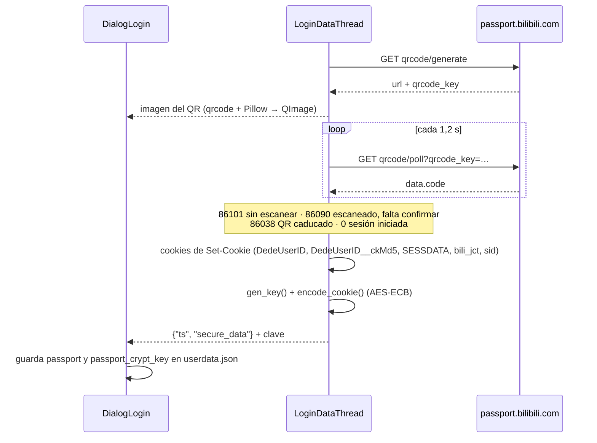

# API de Bilibili y servicios externos

Cómo se comunica BiliDownloader con Bilibili (`src/Lib/bili_api/`) y con el servidor de actualizaciones del autor (`src/Lib/bd_client/`).

---

## 1. Estructura de `Lib/bili_api`

```
bili_api/
├── video.py        Videos normales (BV/AV)
├── bangumi.py      Anime, series y películas (EP/MD/season)
├── user.py         Inicio de sesión por QR y cierre de sesión
├── danmaku.py      Comentarios en pantalla (XML)
├── exceptions/     BiliVideoIdException, NetWorkException, GetWbiException
└── utils/
    ├── data/*.json     Definición de cada endpoint
    ├── network.py      Cliente HTTP (http.client) y DataGetter
    ├── wbisign.py      Firma WBI
    ├── passport.py     Sesión (cookies) y su cifrado
    ├── cookieTools.py  Extraer cookies de Set-Cookie
    ├── matchFomat.py   Reconocer BV/AV/EP/MD en un texto
    ├── fnval.py        Banderas de formato de video
    ├── bvid.py         Validación de BV
    ├── checkAccount.py Validar la sesión
    ├── loadImage.py    Descargar portadas
    └── defaultHeaders.py
```

### Definición de endpoints en JSON

Cada módulo carga su archivo con `get_api(("video",))`. Cada entrada define `url`, `method`, `params` (plantilla con **todos** los parámetros posibles), a veces `body` y `data_type`, y `return.code` (mensajes de error por código). Cada función hace un `deepcopy` de la plantilla, quita con `pop()` los parámetros que no usa y rellena el resto.

---

## 2. Endpoints utilizados

| Archivo JSON | Clave | Método | URL | Uso |
|---|---|---|---|---|
| `video.json` | `info` | GET | `api.bilibili.com/x/web-interface/view` | Información del video y lista de partes |
| | `pages` | GET | `api.bilibili.com/x/player/pagelist` | Lista de partes (sin uso actualmente) |
| | `get_download_url_wbi` | GET | `api.bilibili.com/x/player/wbi/playurl` | **URLs de descarga** (firmado con WBI) |
| | `get_download_url` | GET | `api.bilibili.com/x/player/playurl` | Versión antigua sin firma (sin uso) |
| | `online_count` | GET | `api.bilibili.com/x/player/online/total` | Espectadores en línea |
| `bangumi.json` | `info` | GET | `api.bilibili.com/pgc/review/user` | Información por `media_id` (MD) |
| | `detailed_info` | GET | `api.bilibili.com/pgc/view/web/season` | Temporada y episodios por `season_id` o `ep_id` |
| | `bangumi_url` | GET | `api.bilibili.com/pgc/player/web/v2/playurl` | URLs de descarga de series |
| | `bangumi_url_v2` | POST | `api.bilibili.com/ogv/player/playview` | Alternativa (sin uso actualmente) |
| `user.json` | `get_login_url` | GET | `passport.bilibili.com/x/passport-login/web/qrcode/generate` | Generar QR |
| | `get_login_data` | GET | `passport.bilibili.com/x/passport-login/web/qrcode/poll` | Consultar estado del QR |
| | `get_login_url_old`, `get_login_data_old` | GET/POST | `passport.bilibili.com/qrcode/...` | Versión antigua (sin uso) |
| | `nav` | GET | `api.bilibili.com/x/web-interface/nav` | Claves WBI y validación de sesión |
| | `exit` | POST | `passport.bilibili.com/login/exit/v2` | Cerrar sesión |
| `danmaku.json` | `xml` | GET | `api.bilibili.com/x/v1/dm/list.so` | Danmaku en XML comprimido con *deflate* |

---

## 3. Cliente HTTP (`utils/network.py`)

- `get_data(scheme, host, method, path, query, header, data, data_type, timeout=15)` abre una conexión `http.client`, envía la petición y devuelve el JSON ya decodificado.
  - En POST, el cuerpo se envía como JSON o como `application/x-www-form-urlencoded` según `data_type`.
  - Descomprime la respuesta según `Content-Encoding`: `gzip`, `deflate`, `br` (paquete `brotli`) o `zstd` (paquete `zstandard`).
- `DataGetter` mantiene la conexión abierta para varias peticiones seguidas (se usa en la consulta repetida del QR) y guarda las cabeceras de la última respuesta, necesarias para leer `Set-Cookie`.
- Cabeceras por defecto: `Referer: https://www.bilibili.com`, un `User-Agent` de Chrome 132 y `Accept-Encoding: gzip, deflate, br, zstd`.

---

## 4. Identificadores (`utils/matchFomat.py`)

| Tipo | Patrón | Ejemplo | Qué es |
|---|---|---|---|
| BV | `BV` + 10 caracteres | `BV1Hsu1zKEMP` | Video (identificador actual) |
| AV | `AV` + dígitos | `AV114874017386531` | Video (identificador antiguo) |
| EP | `EP` + dígitos | `EPxxxxxx` | Episodio de una serie |
| MD | `MD` + dígitos | `MDxxxxxx` | Ficha de una serie (el número del enlace de la página de detalles) |

Acepta mayúsculas o minúsculas y funciona sobre URLs completas. Si en el texto aparecen varios tipos, **BV tiene prioridad**; si hay varios tipos y ninguno es BV, se considera inválido. Los enlaces cortos (`b23.tv`) no se resuelven.

---

## 5. Banderas de formato `fnval` (`utils/fnval.py`)

`fnval` es una máscara de bits que indica qué formatos acepta el cliente:

| Constante | Valor | Significado |
|---|---|---|
| `Dash` | 16 | Flujos DASH (video y audio por separado) |
| `HDR` | 64 | HDR |
| `FourK` | 128 | 4K |
| `DolbyAudio` | 256 | Audio Dolby |
| `DolbyVision` | 512 | Dolby Vision (no se usa) |
| `EighK` | 1024 | 8K |
| `AV1` | 2048 | Códec AV1 |
| `HDRVivid` | 16384 | HDR Vivid (no se usa) |

- Valor por defecto: `Dash | AV1 | FourK` = **2192**.
- Con «resolución ultra alta» se añade `EighK | HDR`; con «audio Dolby», `DolbyAudio` (`configwidget.get_fnval`).
- Además, siempre se envía `fourk=1`.

Códecs de video (`utils/video_codec.py`): **7** H.264/AVC (máxima compatibilidad), **12** H.265/HEVC y **13** AV1 (archivos más pequeños, menos compatible con equipos antiguos).

---

## 6. Firma WBI (`utils/wbisign.py`)

Bilibili exige que algunas peticiones (como `wbi/playurl`) vayan firmadas:

1. Se pide `/x/web-interface/nav` (con la cookie si hay sesión) y se toman los nombres de archivo de `wbi_img.img_url` y `wbi_img.sub_url` (`img_key` y `sub_key`).
2. `mixin_key`: se concatenan ambas claves, se reordenan con la tabla fija `_MIXIN_KEY_ENC_TAB` (64 posiciones) y se toman los primeros 32 caracteres.
3. Se añade `wts` (marca de tiempo en segundos), se ordenan los parámetros alfabéticamente y se eliminan los caracteres `!'()*` de los valores.
4. `w_rid = md5(urlencode(params) + mixin_key)`.

Las claves se guardan en una variable global y **se reutilizan durante toda la ejecución** del programa.

---

## 7. Inicio de sesión y sesión (`dialoglogin.py`, `utils/passport.py`)



- **Cifrado de la cookie:** clave aleatoria de 16 bytes; las cookies en JSON se cifran con **AES-ECB** y relleno PKCS#7, y se guardan en Base64 como `secure_data`.
- **Protección de la clave:** en **Windows** se protege con DPAPI (`win32crypt.CryptProtectData`), de modo que solo puede descifrarla el mismo usuario en el mismo equipo. En Linux y macOS se guarda solo en Base64, junto a los datos cifrados.
- **Validación:** `checkAccount.check()` llama a `nav`; devuelve `OK`, `NO_NETWORK` o `FAIL`.
- **Uso:** en cada petición autenticada se descifra y se envía como cabecera `Cookie`. `bili_jct` se usa como token CSRF al cerrar sesión.

---

## 8. Danmaku (`danmaku.py` y `Lib/xml2ass`)

1. `get_danmaku_xml(cid)` descarga `list.so?oid=<cid>` y lo descomprime con `zlib` (*deflate* sin cabecera).
2. `xml2ass.convertMain(xml, 852, 480, text_opacity=0.6)` lo convierte en subtítulos **ASS** (comentarios en movimiento, fijos arriba y fijos abajo), con fuente 黑体 de 20 pt.
3. Se guarda como `NNN-<parte>.ass` junto al video. Si falla, la descarga continúa y se muestra «弹幕下载失败，已跳过» (danmaku omitido).

---

## 9. Servidor de actualizaciones (`update.py`, `Lib/bd_client`)

> Está **desactivado** en el código actual: `NO_UPDATE = True` en `src/update.py`.

- **Servidor:** `www.majjcom.site:11289` (el código del servidor está en [Majjcom/bd_server](https://github.com/Majjcom/bd_server)).
- **Protocolo `rconn`** (TCP):
  - Cada mensaje es `[longitud del JSON: 4 bytes big-endian][JSON {"act", "custom_data_size", "data"}][datos binarios]`.
- **Cifrado:** cada petición genera una clave aleatoria de 32 letras.
  - `sha256(clave + CONST_KEY)` produce la clave AES (caracteres 2–18 del hash) y el *nonce* (6–18).
  - El JSON va cifrado con **AES-GCM**, con la etiqueta (*tag*) de 16 bytes al final.
- **Acciones:**
  - `ver`: devuelve la última versión.
  - `info`: devuelve las notas de la versión en Markdown.
  - `url`: devuelve la URL del instalador, su hash (`md5` o `sha256`) y su nombre.
- **`CONST_KEY`:** está en `Lib/bd_client/const.py`, que **no está en el repositorio** (lo excluye `.gitignore`). Sin ese archivo, la importación de `update.py` falla y la aplicación no arranca. Para trabajar sin conexión basta con crearlo con `CONST_KEY = b""` (debe ser `bytes`, porque se pasa a `sha256.update`).
