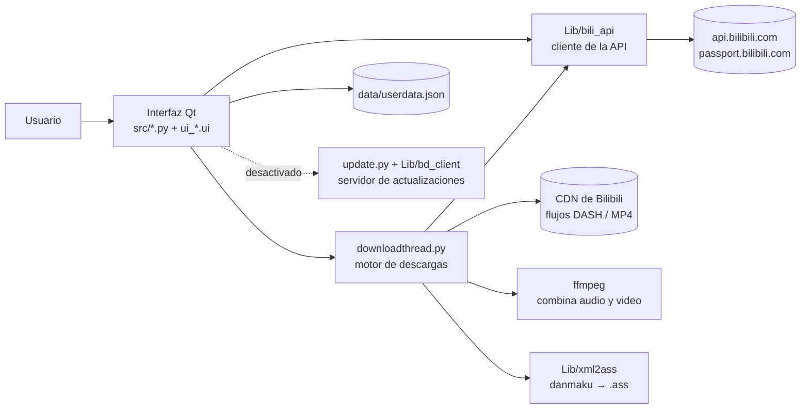
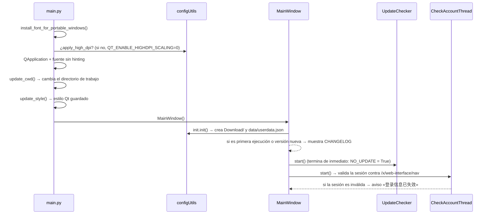
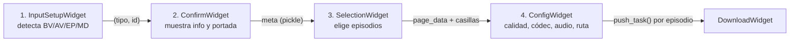

# Arquitectura

Descripción técnica de cómo está organizado BiliDownloader (versión 1.4.0) y cómo fluyen los datos desde que el usuario pega un enlace hasta que el video queda en disco.

Documentos relacionados:

- [API de Bilibili y servicios externos](api-bilibili.md)
- [Motor de descargas](motor-de-descargas.md)
- [Configuración y datos del usuario](configuracion.md)
- [Revisión de código](revision-de-codigo.md)

---

## 1. Visión general

Es una aplicación de escritorio en **Python + PySide6 (Qt 6)**. No usa bases de datos ni servicios propios para descargar: habla directamente con la API web de Bilibili, descarga los flujos DASH de video y audio por separado y los combina con **ffmpeg**.



---

## 2. Estructura del repositorio

```
.
├── src/                      Código de la aplicación
│   ├── main.py               Punto de entrada
│   ├── mainwindow.py         Ventana principal con 4 pestañas
│   ├── *widget.py            Pantallas y componentes de la interfaz
│   ├── dialog*.py            Diálogos
│   ├── downloadthread.py     Motor de descargas (un QThread por tarea)
│   ├── update.py             Buscador/descargador de actualizaciones (desactivado)
│   ├── checkaccount.py       Comprueba al iniciar si la sesión sigue siendo válida
│   ├── compile_ui.py         Compila .ui → ui_*.py y .qrc → res_rc.py
│   ├── clean_ui.py           Borra los archivos generados por compile_ui.py
│   ├── style.py              Hojas de estilo compartidas
│   ├── ui_*.ui               Diseños de Qt Designer (el .py se genera)
│   ├── res.qrc, res/         Recursos embebidos (iconos, imagen de reserva)
│   ├── font/                 Fuente HarmonyOS Sans SC
│   ├── Lib/
│   │   ├── bili_api/         Cliente de la API de Bilibili
│   │   ├── bd_client/        Cliente del servidor de actualizaciones del autor
│   │   └── xml2ass/          Conversor de comentarios (danmaku) XML → ASS
│   ├── utils/                Configuración, versión, utilidades varias
│   ├── nuitka_config/        Configuración de empaquetado para Nuitka
│   └── build_nuitka_*        Scripts de compilación
├── starter/                  Lanzador en C para Windows (pide permisos de administrador)
├── icon/                     Icono de la aplicación
├── server/                   Solo un README: el servidor está en Majjcom/bd_server
└── doc/                      Esta documentación
```

Los archivos `ui_*.py` y `res_rc.py` **no están en el repositorio**: se generan con `python compile_ui.py` (usa `pyside6-uic` y `pyside6-rcc` y guarda una caché de hashes SHA-256 en `.ui_compiled.cache`).

---

## 3. Arranque (`main.py`)



### Directorio de trabajo

Toda la app usa **rutas relativas** al directorio de trabajo (`data/`, `Download/`, `ffmpeg/`, `CHANGELOG.md`, `LICENSE`). `update_cwd()` decide cuál es:

| Sistema | Directorio de trabajo |
|---|---|
| Windows, ejecutando `src/main.py` desde `src/` | La carpeta padre (raíz del repositorio) |
| Windows, ejecutable compilado | La carpeta raíz de la instalación (la que contiene `bin\`). El lanzador `starter/` fija ahí el directorio y ejecuta `bin\BiliDownloader.exe` con `runas`; si se abre `bin\BiliDownloader.exe` directamente, `main.py` sube un nivel |
| Linux | `~/.bili_downloader/` (se crea si no existe) |
| macOS | No se define: queda el directorio desde el que se lanzó (ver [revisión](revision-de-codigo.md)) |

---

## 4. Interfaz

`MainWindow` (`mainwindow.py`) contiene un `QTabWidget` con cuatro pestañas. Cada pestaña es un widget propio que Qt Designer «promociona» en `ui_mainwindow.ui`:

| Pestaña | Clase | Archivo | Función |
|---|---|---|---|
| 输入 Entrada | `InputWidget` | `inputwidget.py` | Asistente de 4 pasos para preparar descargas |
| 下载 Descargas | `DownloadWidget` | `downloadwidget.py` | Cola y progreso de las descargas |
| 设置 Configuración | `SettingsWidget` | `settingswidget.py` | Preferencias, inicio y cierre de sesión |
| 关于 Acerca de | `AboutWidget` | `aboutwidget.py` | Versión, changelog, licencia, «Acerca de Qt» |

Al cambiar de pestaña, `MainWindow.on_tab_changes` llama a `update_tab_changes(anterior, nueva)` en todas: la pestaña de configuración **guarda** al salir y **recarga** al entrar. Al cerrar la ventana también se guarda la configuración y se detienen las descargas.

### Asistente de entrada (`InputWidget`)

`InputWidget` apila cuatro páginas y solo muestra una. Al avanzar llama a `data_update(False)` de la página siguiente; al retroceder, `data_update(True)`. Las páginas se pasan datos leyendo directamente a la anterior (`self.parent().input_pages[n]`).



1. **`InputSetupWidget`** (`inputsetupwidget.py`)
   - Valida el texto con `matchFomat.matchAll()` mientras se escribe; si no reconoce nada, lo pinta de rojo.
   - Al activarse la ventana, lee el portapapeles (`pyperclip`) y, si contiene un identificador válido, lo pega (opción `auto_fill_data_from_clipboard`).
2. **`ConfirmWidget`** (`confirmwidget.py`)
   - Lanza un hilo según el tipo (`LaodInfoAV`, `LoadInfoBV`, `LoadInfoMD`, `LoadInfoEP`) que consulta la API, muestra título, autor, espectadores en línea o puntuación, descripción y portada.
   - Genera `meta = {"title", "page_data": [...]}` serializado con `pickle` en un `QByteArray`.
   - Clic derecho sobre la portada (`ImageLabel`) → guardarla como PNG.
3. **`SelectionWidget`** (`selectionwidget.py`)
   - Tabla con una casilla por episodio (todas marcadas por defecto).
   - Selección por texto: `1-3, 5, 7-9` (rangos ascendentes separados por comas). Con el campo vacío, el botón invierte la selección.
4. **`ConfigWidget`** (`configwidget.py`)
   - Hilo `GetVideoInfo` que pide la URL de reproducción del **primer episodio** para conocer las calidades (`support_formats`), si hay audio **FLAC** o **Dolby** y si hay **traducción de voz con IA** (`language.items`).
   - Por episodio: casillas «descargar danmaku» y «solo audio».
   - Al enviar, crea una tarea por episodio seleccionado y la entrega a `DownloadWidget.push_task()`. Después reinicia el asistente y cambia a la pestaña de descargas.

### Componentes propios

| Clase | Archivo | Descripción |
|---|---|---|
| `CentralCheckBox` | `centralcheckbox.py` | Casilla centrada para usar dentro de tablas |
| `ImageLabel` | `imagelabel.py` | `QLabel` que reescala la portada y ofrece menú «保存封面» (guardar portada) |
| `ColoredLabel` | `coloredlabel.py` | Etiqueta con color arcoíris animado (temporizador de 33 ms) |
| `SpecialColoredLabel` | `specialcoloredlabel.py` | Texto animado «离开设置界面以保存设置» (sal de la configuración para guardar). *Easter egg*: cada 16 clics muestra un mensaje gracioso; tras 15 mensajes desaparece |
| `DownloadItem` | `downloaditem.py` | Fila de la lista de descargas: título, parte, progreso, botones abrir, pausar/reanudar y reiniciar |

### Diálogos

| Clase | Archivo | Uso |
|---|---|---|
| `DialogLogin` | `dialoglogin.py` | Inicio de sesión por código QR |
| `DialogChangeLog` | `dialogchangelog.py` | Muestra `CHANGELOG.md` en Markdown |
| `DialogLicense` | `dialoglicense.py` | Muestra `LICENSE` |
| `DialogDownloadTip` | `dialogdownloadtip.py` | «Añadido a la cola» con casilla «no volver a mostrar» |
| `DialogUpdateInfo`, `DialogDownloadUpdate` | `dialogupdateinfo.py`, `dialogdownloadupdate.py` | Aviso y progreso de actualización (sin uso mientras `NO_UPDATE = True`) |

---

## 5. Modelo de hilos

Todo el trabajo de red se hace fuera del hilo de la interfaz con subclases de `QThread`, que se comunican con la interfaz mediante **señales**:

| Hilo | Archivo | Qué hace |
|---|---|---|
| `UpdateChecker` / `UpdateDownloader` | `update.py` | Buscar y descargar actualizaciones (desactivado) |
| `CheckAccountThread` | `checkaccount.py` | Validar la sesión al arrancar |
| `LoadInfo*` | `confirmwidget.py` | Información del video o serie |
| `GetVideoInfo` | `configwidget.py` | Calidades y pistas de audio disponibles |
| `LoginDataThread` | `dialoglogin.py` | Generar el QR y consultar su estado cada 1,2 s |
| `DownloadTask` | `downloadthread.py` | Una descarga completa (un hilo por tarea activa) |

Los datos complejos entre hilos se envían como `QByteArray` con un `dict` serializado con `pickle` (solo dentro del proceso).

---

## 6. Dónde se guardan los archivos

Dentro del directorio de trabajo (ver sección 3):

```
data/userdata.json     Configuración y sesión (ver configuracion.md)
Download/              Carpeta de descargas por defecto
ffmpeg/ffmpeg.upx.exe  ffmpeg en Windows (ffmpeg/ffmpeg en Linux)
CHANGELOG.md, LICENSE  Mostrados desde la pestaña «Acerca de»
```

Cada descarga se guarda en `<ruta de descarga>/<título>/`:

| Archivo | Cuándo |
|---|---|
| `NNN-<parte>.mp4` | Video (con audio combinado) |
| `NNN-<parte>.m4a` o `.flac` | Si se activó «conservar audio» o «solo audio» |
| `NNN-<parte>.ass` | Si se pidió el danmaku |
| `<nombre>_<uuid>_temp.*`, `_merge.mp4` | Temporales durante la descarga; se borran al terminar o al cerrar la app |

`NNN` es el número de episodio con tres cifras. El título y el nombre pasan por `removeSpecialChars()`, que reemplaza `:~!?@#$%^&*()+/<>,.[]\|"'` y espacios por `_`, y los recorta a **20 caracteres** salvo que se active «quitar el límite de longitud del nombre».
