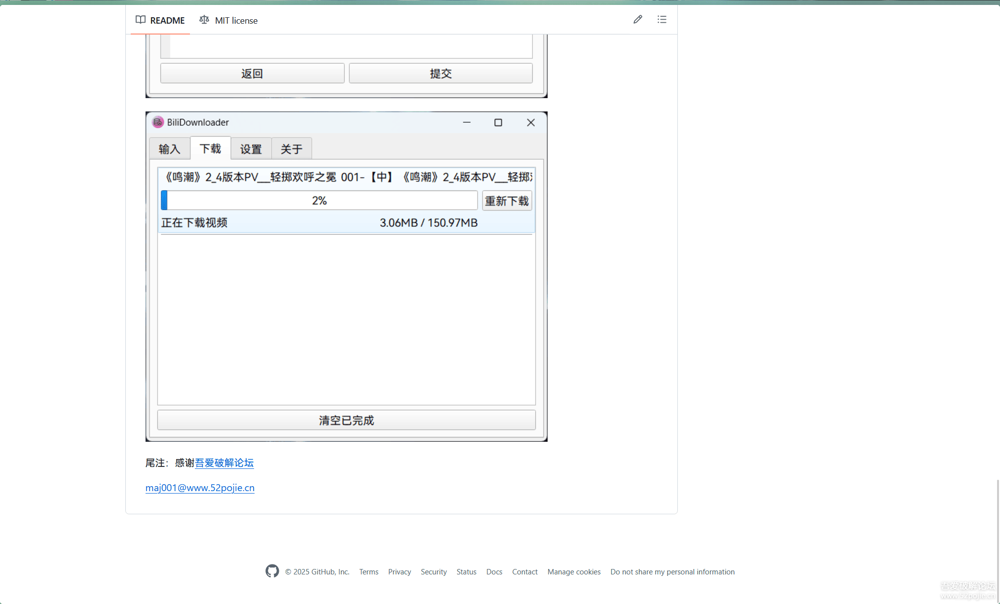
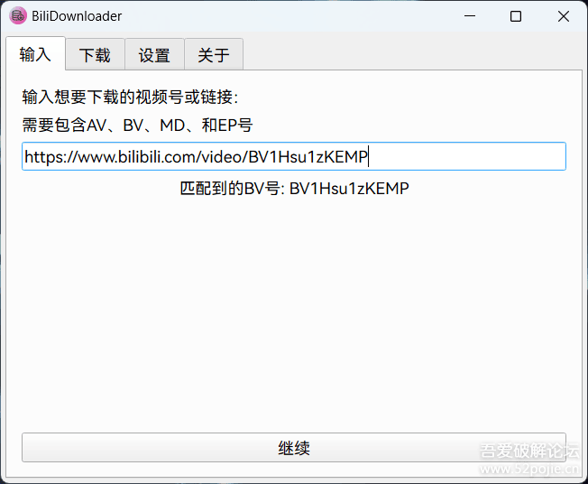
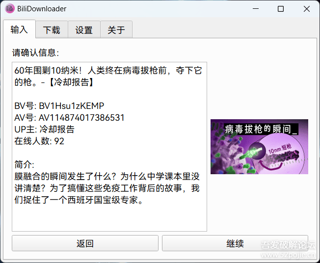
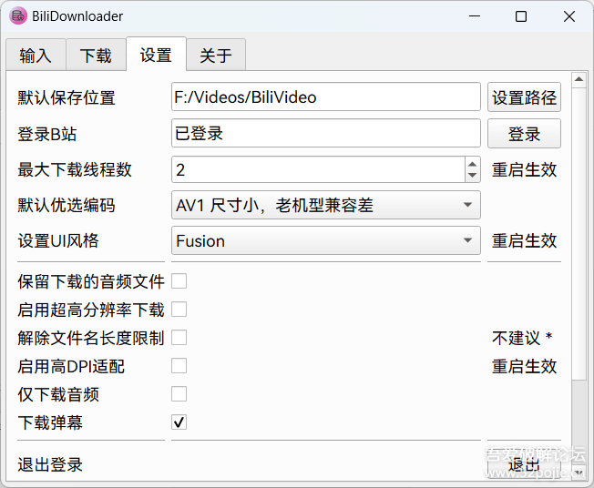

# Guía de usuario de BiliDownloader

> **Fuente:** traducción al español latino de la publicación del autor original (maj001 / Majjcom) en el foro 吾爱破解 (52pojie): [bilibili视频下载器，可下4K、8K、HDR、杜比音频等内容](https://www.52pojie.cn/thread-2048009-1-1.html) (publicada el 2025-07-23, editada por última vez el 2026-07-08). Las capturas de pantalla también provienen de esa publicación.
>
> La guía describe las **versiones oficiales para Windows** que publica el autor. Las notas marcadas como *«Nota de esta adaptación»* son añadidos propios y no forman parte del texto original.

---

## Descripción

BiliDownloader es un programa para descargar videos de Bilibili que admite **4K, 8K, HDR, audio Dolby** y otros formatos. El autor lo empezó como proyecto de práctica mientras aprendía Python y lo compartió porque le resultó bastante útil. La interfaz está hecha con el framework **Qt**.

El código es abierto:

- GitHub: <https://github.com/Majjcom/BiliDownloader>
- Gitee (espejo): <https://gitee.com/majjcom/bili-downloader>

El autor añadió una declaración en los repositorios de GitHub y Gitee para acreditar que el proyecto es original.

---

## Descarga e instalación

Los instaladores y versiones portables se pueden descargar desde Lanzou (蓝奏云):

- Enlace: <https://majjcom.lanzouo.com/b01utd3da>
- Contraseña: `6ww7`

### Versiones disponibles

Desde la versión **1.3.18** existe una versión **Portable** (portable, sin instalación) además del instalador. La versión portable viene en tres variantes:

| Variante | Estado | Para quién |
|---|---|---|
| **Python 3.10** | Estable | **Si no sabes cuál elegir, usa esta** |
| Python 3.12 | Experimental | Es algo más rápida, pero no se ha probado a fondo y puede tener pequeños problemas |
| Python 3.8 | Experimental | Pensada para poder usarse en **Windows 7**. Tampoco se ha probado a fondo y la interfaz vuelve a **Qt5**. Úsala solo si la necesitas |

Entre la versión **instalable** y la **portable** puedes elegir según tu preferencia. La versión instalable recibe correcciones y nuevas funciones mediante actualizaciones, y tú decides si actualizar o no.

> *Nota de esta adaptación:* el [plan de migración](plan-migracion-dependencias.md) de este repositorio apunta a Python y bibliotecas actuales, así que estas variantes (3.8, 3.10, 3.12) corresponden solo a las versiones publicadas por el autor original.

### Migrar la configuración a una versión nueva

Copia la carpeta `data` del directorio del programa y reemplaza con ella la del nuevo directorio del programa.

> **Atención:** por seguridad, la **información de inicio de sesión no se puede migrar** a otro equipo, ni siquiera a otra cuenta en el mismo equipo. Tendrás que volver a iniciar sesión. (Desde la versión 1.3.7 la cookie se cifra con datos del hardware del equipo).

### Actualizaciones

El programa tiene **actualización automática**, pero no obliga a actualizar: si aparece la ventana de nueva versión y pulsas **Cancelar**, no se actualiza.

Si alguien necesita una versión portable sin actualizaciones, puede pedírsela al autor para incluirla en versiones futuras.

---

## Uso

### 1. Introducir el video

Escribe o pega el enlace del video. El programa reconoce automáticamente el número BV o AV para obtener la información. También acepta números **MD** y **EP** (anime y series).

> Por ahora **no se admiten enlaces cortos** (por ejemplo, los de `b23.tv`).

A continuación se muestra la información del video para que la confirmes: título, números BV y AV, autor (UP主), espectadores en línea y descripción, junto con la portada.

### 2. Elegir episodios, calidad y códec

Después puedes elegir los episodios, la **calidad de imagen** y el **códec de video**, e iniciar la descarga.

### 3. Iniciar sesión (opcional)

Puedes iniciar sesión con un **código QR** para descargar videos que requieren membresía y obtener mayor calidad de imagen. Para 8K y HDR se necesita una cuenta con membresía premium (大会员) y activar la resolución ultra alta en la configuración.

### Otras funciones

El autor comenta con humor que el código «tiene un montón de bugs que solo se arreglan a base de actualizaciones» (basta ver el [historial de cambios](../CHANGELOG.md)) y que hay muchas más funciones que no documentó: invita a descubrirlas usando el programa.

---

## Glosario de la interfaz

*Nota de esta adaptación:* en este repositorio la interfaz ya está traducida al español. Esta tabla sirve para las **versiones oficiales del autor**, que siguen en chino, y traduce los textos que aparecen en las capturas.

### Pestañas

| Chino | Español |
|---|---|
| 输入 | Entrada |
| 下载 | Descargas |
| 设置 | Configuración |
| 关于 | Acerca de |

### Pestaña «Entrada» y confirmación

| Chino | Español |
|---|---|
| 输入想要下载的视频号或链接：需要包含AV、BV、MD、和EP号 | Introduce el número o enlace del video que quieres descargar: debe contener un número AV, BV, MD o EP |
| 匹配到的BV号 | Número BV detectado |
| 请确认信息 | Confirma la información |
| UP主 | Autor del video (uploader) |
| 在线人数 | Espectadores en línea |
| 简介 | Descripción |
| 继续 / 返回 / 提交 | Continuar / Volver / Enviar |

### Pestaña «Descargas»

| Chino | Español |
|---|---|
| 正在下载视频 | Descargando video |
| 重新下载 | Volver a descargar |
| 清空已完成 | Limpiar completados |

### Pestaña «Configuración»

| Chino | Español | Observaciones |
|---|---|---|
| 默认保存位置 / 设置路径 | Ubicación de guardado predeterminada / Establecer ruta | |
| 登录B站 / 登录 / 已登录 | Iniciar sesión en Bilibili / Iniciar sesión / Sesión iniciada | Inicio de sesión con código QR |
| 最大下载线程数 | Número máximo de hilos de descarga | 重启生效: requiere reiniciar |
| 默认优选编码 | Códec preferido predeterminado | «AV1 尺寸小，老机型兼容差»: AV1, archivos pequeños pero poco compatible con equipos antiguos |
| 设置UI风格 | Estilo de la interfaz | Requiere reiniciar |
| 保留下载的音频文件 | Conservar los archivos de audio descargados | |
| 启用超高分辨率下载 | Activar descarga en resolución ultra alta | 8K y HDR, requiere membresía premium |
| 解除文件名长度限制 | Quitar el límite de longitud del nombre de archivo | 不建议: no recomendado |
| 启用高DPI适配 | Activar adaptación a alta densidad (DPI) | Requiere reiniciar |
| 仅下载音频 | Descargar solo audio | |
| 下载弹幕 | Descargar comentarios en pantalla (danmaku) | |
| 退出登录 / 退出 | Cerrar sesión / Salir | |
