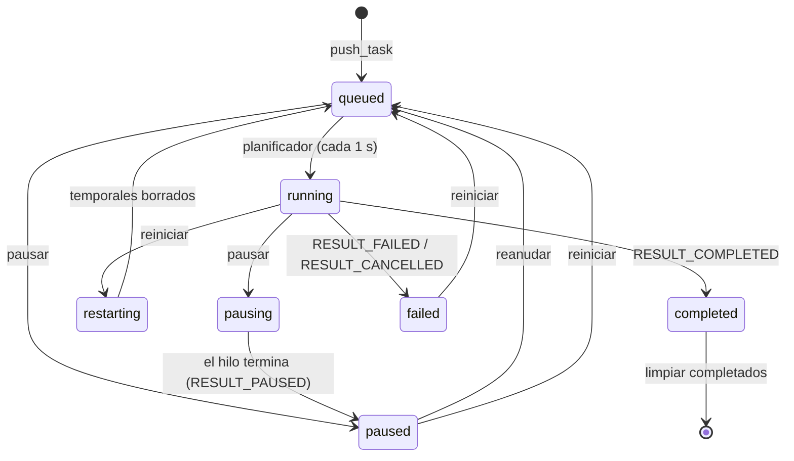
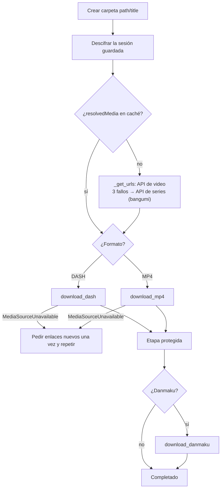

# Motor de descargas

Funcionamiento de la cola de descargas (`src/downloadwidget.py`) y de cada tarea (`src/downloadthread.py`), rediseñados en la versión 1.4.0 con pausa, reanudación y reintentos.

---

## 1. Tarea de descarga

`ConfigWidget` crea un `dict` por episodio y lo entrega a `DownloadWidget.push_task()`:

| Clave | Origen | Descripción |
|---|---|---|
| `path` | Configuración / diálogo | Carpeta base de descarga |
| `title` | API | Título del video o serie (limpio, carpeta de destino) |
| `name` | API | `NNN-<nombre de la parte>` (nombre de archivo) |
| `id`, `isbvid` | Entrada | BV (`isbvid=True`) o número AV |
| `cid` | API | Identificador de la parte |
| `type` | — | `"video"`; cambia a `"bangumi"` si la API de videos falla |
| `quality` | Selector | Id de calidad elegido (p. ej. 80 = 1080p) |
| `codec` | Selector | 7 AVC, 12 HEVC, 13 AV1 |
| `fnval` | Configuración | Máscara de formatos ([ver API](api-bilibili.md#5-banderas-de-formato-fnval-utilsfnvalpy)) |
| `specialAudio` | Selector | `None`, `"flac"` o `"dolby"` |
| `aiLanguage` | Selector | Idioma de la traducción de voz con IA (`cur_language`) |
| `onlyAudio`, `reserveAudio`, `saveDanmaku` | Casillas / configuración | Opciones de salida |

`push_task()` añade además:

- **Control:** `state`, `pending_action`, `parent` y `tempName` (`<name>_<uuid>`).
- **Interfaz:** `widget` (un `DownloadItem`) e `item` (el elemento de la lista).

Durante la descarga, la propia tarea guarda:

- `streamStates`: por flujo (`video`/`audio`), la URL, la ruta, el tamaño, el validador (ETag/Last-Modified) y si está completo.
- `resolvedMedia`: la respuesta de la API cacheada para reanudar sin volver a pedir los enlaces.

---

## 2. Cola (`DownloadWidget`)

- **Listas:**
  - `tasks`: cola pendiente. Las nuevas se insertan al principio y se sacan por el final, así que es FIFO. Las reanudadas o reiniciadas se añaden al final y **pasan delante** de las nuevas.
  - `running_tasks`, `paused_tasks`, `finished`, `all_tasks`.
- **Planificador:** un `QTimer` de **1 s** arranca una tarea si hay menos activas que `max_thread_count`.
  - En el original la opción se llama «hilos de descarga» (最大下载线程数), pero es el número de **descargas simultáneas** (así se llama en la interfaz traducida), y solo se lee al iniciar la app.
- **Duplicados:** no arranca dos tareas con el mismo destino (`path/title/name`) al mismo tiempo.
- **Limpiar completados:** quita de la lista las tareas terminadas.
- **Al cerrar la ventana (`shutdown`):**
  - Cancela las tareas activas y espera a que terminen.
  - Luego **borra los archivos temporales de todas las tareas**: las descargas pausadas no se conservan entre ejecuciones.
  - Si no puede borrarlos, lo reintenta hasta 3 veces antes de cerrar.

### Estados de una tarea

Pausar o reiniciar solo se permite mientras la tarea **no** esté en su etapa protegida: la combinación con ffmpeg, el renombrado final y el danmaku. En esa etapa los botones se desactivan.

---

## 3. Ejecución de una tarea (`DownloadTask.run`)

### DASH (`download_dash`)

1. **Calidad:** la más alta disponible que sea ≤ la pedida; si ninguna lo es, la más baja.
2. **Códec:** el pedido si existe en esa calidad; si no, el de menor `codecid`.
3. **Audio:** el de mayor `bandwidth`. Si se pidió FLAC o Dolby y existe, se pone primero.
4. **Tamaño de cada flujo** (`_probe_stream_size`): petición con `Range: bytes=0-0`; el total se lee de `Content-Range` (o de `Content-Length`).
5. **Descarga** (`_download_stream`) en bloques de 64 KiB, primero el video y luego el audio.
6. **Combinación:** `ffmpeg -i video -i audio -c:v copy -c:a copy` → `NNN-<parte>.mp4`. No recodifica, así que es rápido.
7. **Limpieza:** borra los temporales; conserva el audio si se activó «conservar audio» o «solo audio».

Si no hay pista de audio, el video se guarda directamente. Si se pidió «solo audio», se omite el video.

### MP4 (`download_mp4`)

Algunas series solo ofrecen MP4. Se admite únicamente si el archivo es **de un solo segmento**. No es compatible con «solo audio».

---

## 4. Reanudación y reintentos

- **Reanudar:** si el archivo temporal ya tiene datos, se pide `Range: bytes=<offset>-` con `If-Range` (ETag o Last-Modified).
  - Si el servidor responde **206**, se añade al final del archivo.
  - Si responde **200** (ignora el rango), se vuelve a empezar desde cero.
- **Cambio de archivo:** si el validador o el tamaño cambian, el flujo se descarta y se descarga desde cero (`StreamChanged`).
- **Reintentos por flujo:** 3 intentos (2 si se usan enlaces cacheados), con una espera de 2 s en la que se atienden pausa y cancelación.
  - Los errores HTTP 401, 403, 404, 410 y 416 no se reintentan: provocan de inmediato que se pidan **enlaces nuevos**, una sola vez por ejecución.
- **Enlaces:** 3 intentos con la API de videos y, si falla, 3 más con la de series.

### Archivos temporales

`<tempName>_temp.mp4`, `_temp.m4a`, `_temp.flac`, `_temp.ass` y `_merge.mp4` en la carpeta del título. `DownloadWidget._remove_partial_files()` los borra al reiniciar una tarea o al cerrar la aplicación.

---

## 5. ffmpeg

- Ruta: `<directorio de trabajo>/ffmpeg/ffmpeg.upx.exe` en Windows (comprimido con UPX desde la 1.3.19) o `ffmpeg/ffmpeg` en Linux.
- En Windows se lanza con `CREATE_NO_WINDOW` para que no aparezca una consola.
- La salida de ffmpeg se descarta (`os.devnull`). Si falla, solo se muestra «Falló la combinación con ffmpeg».
